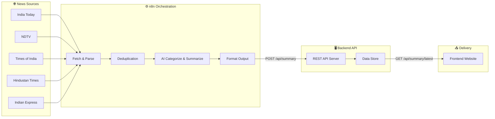
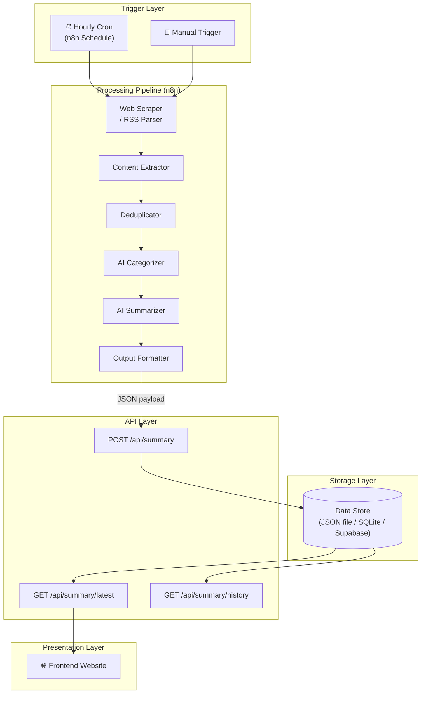
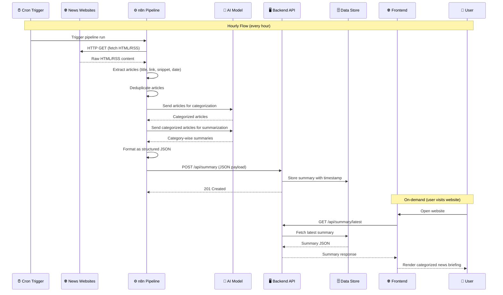
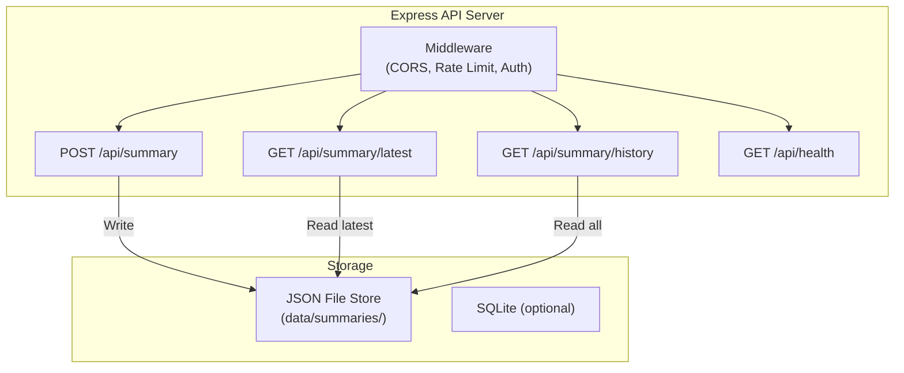
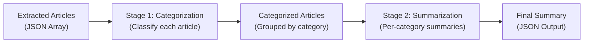
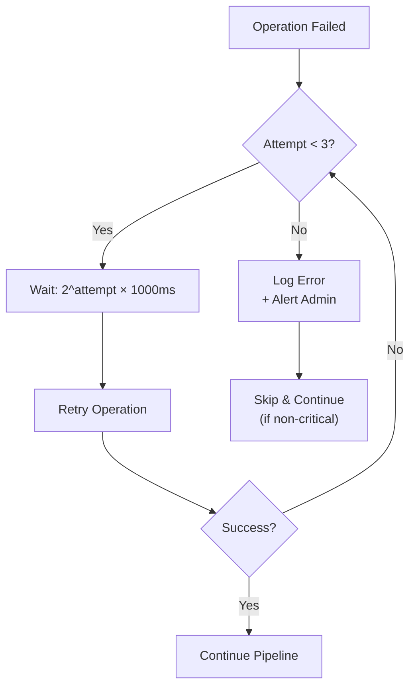
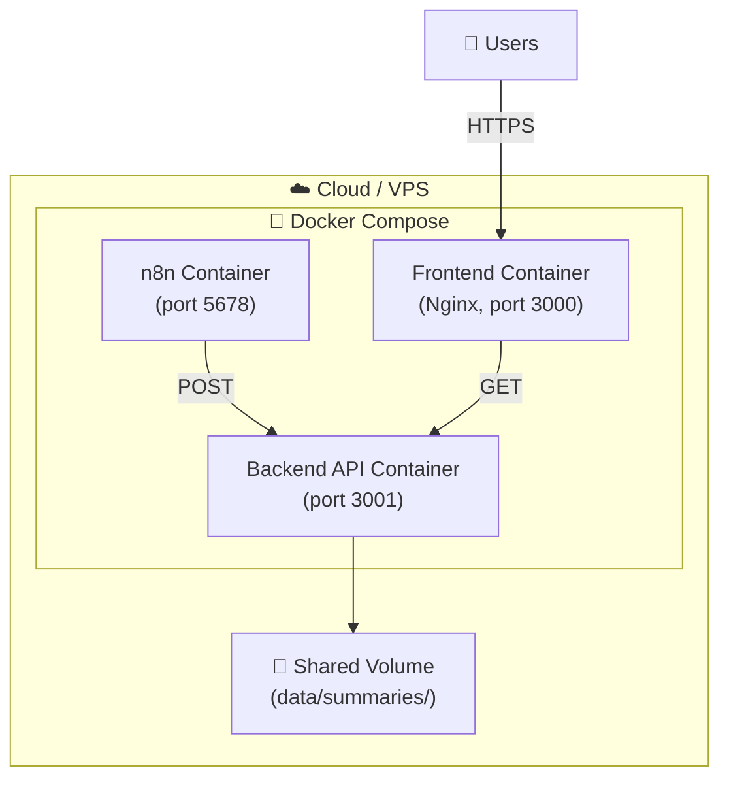
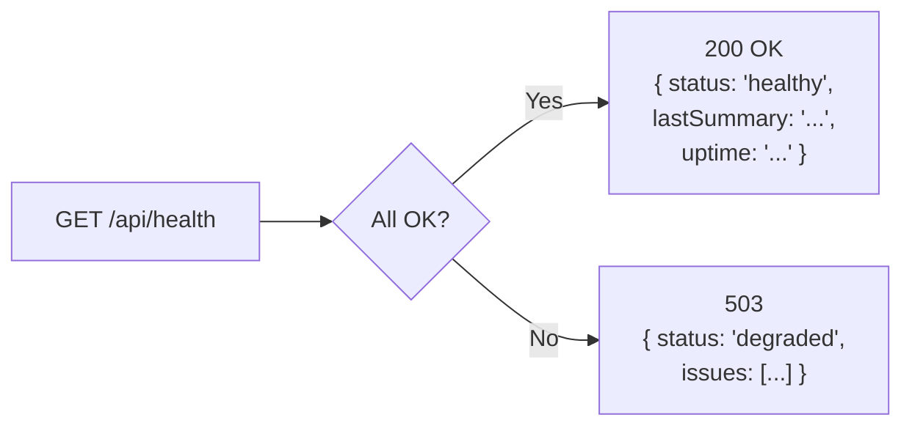

# Architecture: AI News Summarizer Agent for India

---

## Table of Contents

1. [High-Level System Overview](#1-high-level-system-overview)
2. [Architecture Principles](#2-architecture-principles)
3. [Component Breakdown](#3-component-breakdown)
4. [Data Flow](#4-data-flow)
5. [n8n Workflow Architecture](#5-n8n-workflow-architecture)
6. [Backend API Layer](#6-backend-api-layer)
7. [Frontend Website](#7-frontend-website)
8. [Data Storage Design](#8-data-storage-design)
9. [AI / LLM Integration](#9-ai--llm-integration)
10. [Error Handling & Resilience](#10-error-handling--resilience)
11. [Security Considerations](#11-security-considerations)
12. [Deployment Architecture](#12-deployment-architecture)
13. [Monitoring & Observability](#13-monitoring--observability)
14. [Technology Stack Summary](#14-technology-stack-summary)
15. [API Contract](#15-api-contract)
16. [Directory & File Structure](#16-directory--file-structure)

---

## 1. High-Level System Overview

The system consists of four major components working together to deliver an automated, end-to-end India news summarization pipeline.



| Component | Responsibility |
|-----------|---------------|
| **News Sources** | Publicly accessible Indian news websites providing raw HTML/RSS content |
| **n8n Orchestration** | Hourly pipeline: fetch → parse → deduplicate → categorize → summarize → publish |
| **Backend API** | Receives, stores, and serves the latest summary payload (JSON) |
| **Frontend Website** | Responsive web app displaying the latest categorized news briefing |

---

## 2. Architecture Principles

| Principle | Description |
|-----------|-------------|
| **Loose Coupling** | Each component communicates via well-defined APIs; replacing one does not break others |
| **Atomic Updates** | The website always shows a complete summary — never a half-written one |
| **Idempotent Runs** | Re-running the pipeline for the same hour produces the same result without duplication |
| **Graceful Degradation** | If one news source is down, the pipeline continues with the remaining sources |
| **Single Source of Truth** | The backend data store is the canonical latest summary; the website reads from it |
| **Separation of Concerns** | Scraping, AI processing, storage, and presentation are distinct layers |

---

## 3. Component Breakdown

### 3.1 Component Interaction Diagram



### 3.2 Component Inventory

| # | Component | Type | Technology | Description |
|---|-----------|------|------------|-------------|
| 1 | Schedule Trigger | n8n Node | Cron Trigger | Fires every hour + manual trigger |
| 2 | Source Config | n8n Node | Set Node | Stores the 4–5 news source URLs |
| 3 | Web Scraper | n8n Node | HTTP Request | Fetches raw HTML / RSS from news sites |
| 4 | Content Extractor | n8n Node | Function / HTML Extract | Parses titles, links, snippets, dates |
| 5 | Deduplicator | n8n Node | Function | Removes duplicate articles by URL/title similarity |
| 6 | AI Categorizer | n8n Node | LLM (OpenAI / Gemini) | Classifies each article into a category |
| 7 | AI Summarizer | n8n Node | LLM (OpenAI / Gemini) | Generates concise category-wise summaries |
| 8 | Output Formatter | n8n Node | Function | Structures output as JSON + optional Markdown |
| 9 | Publisher | n8n Node | HTTP Request | POSTs the summary to the backend API |
| 10 | Backend API | Server | Node.js (Express) | REST API for storing and serving summaries |
| 11 | Data Store | Storage | JSON file / SQLite / Supabase | Persists summary payloads with timestamps |
| 12 | Frontend Website | Web App | HTML / CSS / JavaScript | Responsive website displaying the latest briefing |

---

## 4. Data Flow

### 4.1 End-to-End Data Pipeline



### 4.2 Data Transformation Stages

```
Raw HTML / RSS
    │
    ▼
┌─────────────────────────────────────────────┐
│ Extracted Articles (Array)                  │
│  { title, url, snippet, date, source }      │
└─────────────────────────────────────────────┘
    │
    ▼
┌─────────────────────────────────────────────┐
│ Deduplicated Articles (Array)               │
│  Same shape, duplicates removed             │
└─────────────────────────────────────────────┘
    │
    ▼
┌─────────────────────────────────────────────┐
│ Categorized Articles (Grouped Object)       │
│  { "Politics": [...], "Sports": [...] }     │
└─────────────────────────────────────────────┘
    │
    ▼
┌─────────────────────────────────────────────┐
│ Final Summary Payload (JSON)                │
│  { timestamp, categories: [ { name,         │
│     summary, sources: [...] } ] }           │
└─────────────────────────────────────────────┘
```

---

## 5. n8n Workflow Architecture

### 5.1 Primary Workflow: Hourly News Pipeline

```mermaid
flowchart LR
    T["🕐 Schedule Trigger\n(Every Hour)"] --> CFG["📋 Set Source URLs"]
    CFG --> SPLIT["🔀 Split Into Items\n(1 per URL)"]
    SPLIT --> HTTP["🌐 HTTP Request\n(Fetch HTML/RSS)"]
    HTTP --> PARSE["📄 Function:\nExtract Articles"]
    PARSE --> MERGE["🔗 Merge All Articles"]
    MERGE --> DEDUP["🧹 Function:\nDeduplicate"]
    DEDUP --> CAT["🤖 AI Agent:\nCategorize"]
    CAT --> SUM["🤖 AI Agent:\nSummarize"]
    SUM --> FMT["📦 Function:\nFormat JSON Output"]
    FMT --> PUB["📤 HTTP Request:\nPOST to API"]
    PUB --> OK{"✅ Success?"}
    OK -->|Yes| LOG_OK["📝 Log Success"]
    OK -->|No| ERR["⚠️ Error Handler"]
    ERR --> NOTIFY["🔔 Error Notification"]
```



### 5.2 Node Details

#### Trigger Node
```json
{
  "type": "n8n-nodes-base.scheduleTrigger",
  "parameters": {
    "rule": {
      "interval": [{ "field": "hours", "hoursInterval": 1 }]
    }
  }
}
```

#### Source Configuration Node
```json
{
  "type": "n8n-nodes-base.set",
  "parameters": {
    "values": {
      "string": [
        { "name": "sources", "value": "[\"https://www.indiatoday.in/\", \"https://www.ndtv.com/india\", \"https://timesofindia.indiatimes.com/india\", \"https://www.hindustantimes.com/india-news\", \"https://indianexpress.com/section/india/\"]" }
      ]
    }
  }
}
```

#### Content Extraction (Function Node) — Pseudocode

```javascript
// Function Node: Extract articles from HTML
const cheerio = require('cheerio');

const html = $input.item.json.data; // raw HTML from HTTP Request
const sourceUrl = $input.item.json.url;
const $ = cheerio.load(html);

const articles = [];

// Site-specific selectors (configurable per source)
$('article, .story-card, .news-card').each((i, el) => {
  const title = $(el).find('h2, h3, .title').first().text().trim();
  const link  = $(el).find('a').first().attr('href');
  const snippet = $(el).find('p, .synopsis').first().text().trim();
  const date = $(el).find('time, .date').first().attr('datetime') || '';

  if (title && link) {
    articles.push({
      title,
      url: link.startsWith('http') ? link : new URL(link, sourceUrl).href,
      snippet,
      publishedAt: date,
      source: new URL(sourceUrl).hostname.replace('www.', '')
    });
  }
});

return articles.map(a => ({ json: a }));
```

#### Deduplication (Function Node) — Pseudocode

```javascript
// Function Node: Remove duplicates by normalized title similarity
const articles = $input.all().map(item => item.json);
const seen = new Map();

const unique = articles.filter(article => {
  const normalized = article.title
    .toLowerCase()
    .replace(/[^a-z0-9\s]/g, '')
    .replace(/\s+/g, ' ')
    .trim();

  // Check for substring match or exact duplicate
  for (const [key] of seen) {
    if (key.includes(normalized) || normalized.includes(key)) {
      return false; // duplicate
    }
  }
  seen.set(normalized, true);
  return true;
});

return unique.map(a => ({ json: a }));
```

---

## 6. Backend API Layer

### 6.1 Overview

A lightweight **Node.js + Express** server that acts as the bridge between the n8n pipeline and the frontend website.

### 6.2 Architecture



### 6.3 API Endpoints

| Method | Endpoint | Description | Auth |
|--------|----------|-------------|------|
| `POST` | `/api/summary` | Receive & store a new summary from n8n | API Key |
| `GET` | `/api/summary/latest` | Return the most recent summary | Public |
| `GET` | `/api/summary/history` | Return last N summaries (paginated) | Public |
| `GET` | `/api/health` | Health check endpoint | Public |

### 6.4 Middleware Stack

```
Request
  │
  ├─ CORS (allow frontend origin)
  ├─ express.json() (body parser, 1 MB limit)
  ├─ Rate Limiter (100 req/15min per IP)
  ├─ API Key Auth (POST routes only)
  │
  ▼
Route Handler
```

### 6.5 Server Configuration

```javascript
// config.js
module.exports = {
  PORT: process.env.PORT || 3001,
  API_KEY: process.env.API_KEY || 'your-secret-api-key',
  DATA_DIR: process.env.DATA_DIR || './data/summaries',
  CORS_ORIGIN: process.env.CORS_ORIGIN || 'http://localhost:3000',
  MAX_HISTORY: process.env.MAX_HISTORY || 168, // 7 days × 24 hours
};
```

---

## 7. Frontend Website

### 7.1 Architecture

A **static single-page application** (HTML + CSS + JavaScript) that fetches data from the backend API and renders a responsive news briefing.

```mermaid
flowchart LR
    subgraph Browser["🌐 Browser"]
        HTML["index.html"]
        CSS["styles.css"]
        JS["app.js"]
    end

    subgraph API["Backend"]
        EP["GET /api/summary/latest"]
    end

    JS -->|fetch()| EP
    EP -->|JSON| JS
    JS -->|render| HTML
    CSS -->|style| HTML
```

### 7.2 Page Structure

```
┌─────────────────────────────────────────────────────────────┐
│  🇮🇳  India News Briefing              Last updated: ...    │
│─────────────────────────────────────────────────────────────│
│                                                             │
│  ┌─────────────────┐  ┌─────────────────┐                  │
│  │ 🏛️ Politics      │  │ ⚽ Sports        │                  │
│  │ ─────────────── │  │ ─────────────── │                  │
│  │ • Summary point │  │ • Summary point │                  │
│  │ • Summary point │  │ • Summary point │                  │
│  │   Source: [link] │  │   Source: [link] │                  │
│  └─────────────────┘  └─────────────────┘                  │
│                                                             │
│  ┌─────────────────┐  ┌─────────────────┐                  │
│  │ 💼 Business      │  │ 💻 Technology    │                  │
│  │ ─────────────── │  │ ─────────────── │                  │
│  │ • Summary point │  │ • Summary point │                  │
│  │   Source: [link] │  │   Source: [link] │                  │
│  └─────────────────┘  └─────────────────┘                  │
│                                                             │
│  ┌─────────────────┐  ┌─────────────────┐                  │
│  │ 🎬 Entertainment │  │ 🏥 Health        │                  │
│  │ ...              │  │ ...              │                  │
│  └─────────────────┘  └─────────────────┘                  │
│                                                             │
│─────────────────────────────────────────────────────────────│
│  Footer  •  Auto-refreshes every 15 min  •  Powered by AI  │
└─────────────────────────────────────────────────────────────┘
```

### 7.3 Key Frontend Features

| Feature | Implementation |
|---------|---------------|
| **Auto-refresh** | `setInterval` polls `GET /api/summary/latest` every 15 minutes |
| **Responsive layout** | CSS Grid / Flexbox, mobile-first media queries |
| **Dark mode** | `prefers-color-scheme` media query + manual toggle |
| **Category icons** | Emoji or icon set mapped to each category name |
| **Skeleton loading** | CSS shimmer animation while fetching data |
| **Error state** | Friendly "Unable to load" message with retry button |
| **Relative timestamps** | "Updated 23 minutes ago" using `Intl.RelativeTimeFormat` |

### 7.4 Frontend File Structure

```
frontend/
├── index.html          # Main HTML page
├── css/
│   └── styles.css      # All styles (design system + components)
├── js/
│   └── app.js          # Fetch API, render logic, auto-refresh
└── assets/
    ├── favicon.ico
    └── og-image.png    # Open Graph preview image
```

## 8. Data Storage Design

### 8.1 Storage Strategy

The system uses a **file-based JSON store** for simplicity, with an optional upgrade path to SQLite or a cloud database.

```
data/
└── summaries/
    ├── latest.json              # Always contains the most recent summary
    ├── 2026-07-26T05-00.json    # Archived hourly summaries
    ├── 2026-07-26T06-00.json
    ├── 2026-07-26T07-00.json
    └── ...
```

### 8.2 Summary Payload Schema

```json
{
  "id": "summary_2026-07-26T11-00-00Z",
  "timestamp": "2026-07-26T11:00:00Z",
  "generatedAt": "2026-07-26T11:02:34Z",
  "sourcesUsed": [
    "indiatoday.in",
    "ndtv.com",
    "timesofindia.indiatimes.com",
    "hindustantimes.com",
    "indianexpress.com"
  ],
  "totalArticlesProcessed": 47,
  "totalArticlesAfterDedup": 32,
  "categories": [
    {
      "name": "Politics",
      "icon": "🏛️",
      "articleCount": 6,
      "summaryPoints": [
        "Parliament passed the Digital India Bill 2026 with bipartisan support, introducing new data privacy safeguards.",
        "The Election Commission announced dates for upcoming state elections in three states."
      ],
      "sources": [
        {
          "title": "Parliament passes Digital India Bill",
          "url": "https://www.ndtv.com/india/parliament-passes-digital-india-bill-12345",
          "source": "ndtv.com",
          "publishedAt": "2026-07-26T09:30:00Z"
        }
      ]
    }
  ],
  "metadata": {
    "modelUsed": "gpt-4o / gemini-2.5-flash",
    "pipelineDurationMs": 45200,
    "errors": []
  }
}
```

### 8.3 Storage Lifecycle

| Action | Trigger | Retention |
|--------|---------|-----------|
| **Write `latest.json`** | Every successful pipeline run | Always overwritten |
| **Archive timestamped file** | Every successful pipeline run | 7 days (168 files max) |
| **Cleanup old archives** | After each write | Delete files older than 7 days |

### 8.4 Atomic Write Strategy

To prevent the website from reading a half-written file:

```javascript
// Write to a temp file, then atomically rename
const tempPath = path.join(DATA_DIR, `latest.tmp.${Date.now()}.json`);
const finalPath = path.join(DATA_DIR, 'latest.json');

fs.writeFileSync(tempPath, JSON.stringify(payload, null, 2));
fs.renameSync(tempPath, finalPath); // atomic on same filesystem
```

---

## 9. AI / LLM Integration

### 9.1 Model Selection

| Option | Model | Pros | Cons |
|--------|-------|------|------|
| **Primary** | OpenAI `gpt-4o` | High quality, fast, good at categorization | Cost per token |
| **Alternative** | Google `gemini-2.5-flash` | Fast, cost-effective, good quality | Slightly less mature in n8n |
| **Fallback** | OpenAI `gpt-4o-mini` | Very cheap, fast | Lower quality summaries |

### 9.2 AI Pipeline Design

The AI processing is split into **two stages** for reliability and control:



#### Stage 1: Categorization Prompt

```text
You are a news categorization assistant. Given a list of Indian news articles,
classify each article into exactly ONE of these categories:
Politics, Sports, Business, Technology, Entertainment, Health, Education, Crime,
Weather, World.

Return a JSON array where each item has the original article fields plus a
"category" field.

Rules:
- Use only the provided article text to determine the category.
- If unsure, choose the most relevant category.
- Do not invent or modify article content.

Articles:
{{$json.articles}}
```

#### Stage 2: Summarization Prompt

```text
You are an AI news summarization assistant for an India news briefing.

Given the following categorized news articles, produce a concise summary for
each category. Output must be valid JSON matching this schema:

{
  "categories": [
    {
      "name": "Category Name",
      "summaryPoints": ["Point 1", "Point 2"],
      "sources": [{ "title": "...", "url": "...", "source": "..." }]
    }
  ]
}

Rules:
1. Use ONLY information from the provided articles.
2. Do NOT invent facts or hallucinate details.
3. Keep each summary point to 1–2 sentences max.
4. Include 2–5 summary points per category.
5. Include all source links.
6. Use neutral, factual language.
7. Omit categories with no articles.
8. Skip advertisements and navigation text.

Categorized Articles:
{{$json.categorizedArticles}}
```

### 9.3 Token Budget Estimation

| Stage | Input Tokens (est.) | Output Tokens (est.) | Cost (GPT-4o) |
|-------|--------------------|--------------------|---------------|
| Categorization | ~8,000 | ~3,000 | ~$0.04 |
| Summarization | ~5,000 | ~2,000 | ~$0.03 |
| **Total per run** | ~13,000 | ~5,000 | **~$0.07** |
| **Daily (24 runs)** | ~312,000 | ~120,000 | **~$1.68** |
| **Monthly** | - | - | **~$50** |

---

## 10. Error Handling & Resilience

### 10.1 Error Taxonomy

| Error Type | Example | Handling Strategy |
|------------|---------|-------------------|
| **Source Unavailable** | News site returns 5xx or timeout | Skip source, continue with others, log warning |
| **Parse Failure** | HTML structure changed, no articles found | Skip source, alert for parser update, log error |
| **AI API Error** | Rate limit, timeout, invalid response | Retry with exponential backoff (3 attempts) |
| **Invalid AI Output** | JSON parse failure from LLM | Retry with stricter prompt, fall back to raw text |
| **Backend API Down** | Cannot POST summary | Queue locally, retry on next run |
| **Storage Write Failure** | Disk full, permission error | Alert admin immediately, do not overwrite latest |

### 10.2 Retry Strategy



### 10.3 Circuit Breaker for News Sources

```javascript
// Per-source circuit breaker state
const circuitBreakers = {
  'indiatoday.in':   { failures: 0, lastFailure: null, open: false },
  'ndtv.com':        { failures: 0, lastFailure: null, open: false },
  // ...
};

const THRESHOLD = 3;       // consecutive failures to open circuit
const COOL_DOWN = 3600000; // 1 hour before retrying an open circuit
```

---

## 11. Security Considerations

| Area | Measure |
|------|---------|
| **API Key Authentication** | `POST /api/summary` requires `X-API-Key` header; reject unauthorized writes |
| **CORS** | Restrict to frontend origin only |
| **Rate Limiting** | 100 requests per 15 minutes per IP on public endpoints |
| **Input Validation** | Validate and sanitize all incoming summary JSON payloads |
| **No Secrets in Code** | All credentials via environment variables or n8n credentials store |
| **Content Sanitization** | Sanitize HTML in article snippets to prevent XSS on the frontend |
| **HTTPS** | All API communication over TLS in production |
| **Dependency Audit** | Regular `npm audit` on backend and frontend dependencies |

---

## 12. Deployment Architecture

### 12.1 Deployment Diagram



### 12.2 Docker Compose Structure

```yaml
# docker-compose.yml (simplified)
version: '3.8'

services:
  n8n:
    image: n8nio/n8n:latest
    ports:
      - "5678:5678"
    environment:
      - GENERIC_TIMEZONE=Asia/Kolkata
      - N8N_BASIC_AUTH_ACTIVE=true
      - N8N_BASIC_AUTH_USER=${N8N_USER}
      - N8N_BASIC_AUTH_PASSWORD=${N8N_PASSWORD}
    volumes:
      - n8n_data:/home/node/.n8n

  backend:
    build: ./backend
    ports:
      - "3001:3001"
    environment:
      - API_KEY=${API_KEY}
      - CORS_ORIGIN=http://localhost:3000
    volumes:
      - summary_data:/app/data/summaries

  frontend:
    build: ./frontend
    ports:
      - "3000:80"
    depends_on:
      - backend

volumes:
  n8n_data:
  summary_data:
```

### 12.3 Environment Variables

| Variable | Service | Description |
|----------|---------|-------------|
| `API_KEY` | Backend | Secret key for authenticating n8n POST requests |
| `PORT` | Backend | API server port (default: 3001) |
| `CORS_ORIGIN` | Backend | Allowed frontend origin |
| `DATA_DIR` | Backend | Path to summary storage directory |
| `BACKEND_API_URL` | n8n | Backend API base URL |
| `N8N_USER` | n8n | Basic auth username |
| `N8N_PASSWORD` | n8n | Basic auth password |
| `GENERIC_TIMEZONE` | n8n | Timezone for cron triggers |
| `OPENAI_API_KEY` | n8n | API key for OpenAI (or Gemini equivalent) |

---

## 13. Monitoring & Observability

### 13.1 Logging Strategy

| Component | Log Destination | What to Log |
|-----------|----------------|-------------|
| n8n Workflows | n8n Execution Log | Each node's input/output, errors, duration |
| Backend API | `stdout` + log file | Incoming requests, response codes, errors |
| Frontend | Browser console | API fetch errors, render issues |

### 13.2 Health Monitoring



### 13.3 Key Metrics to Track

| Metric | Target | Alert Threshold |
|--------|--------|-----------------|
| Pipeline success rate | 100% | < 90% in 24h |
| Pipeline duration | < 120s | > 300s |
| Articles collected per run | 30–60 | < 10 |
| API response time (`GET /latest`) | < 100ms | > 500ms |
| Summary freshness | < 1 hour | > 2 hours stale |

---

## 14. Technology Stack Summary

| Layer | Technology | Version | Purpose |
|-------|-----------|---------|---------|
| **Orchestration** | n8n | Latest | Workflow automation, scheduling, AI integration |
| **Backend Runtime** | Node.js | 20 LTS | API server runtime |
| **Backend Framework** | Express.js | 4.x | REST API framework |
| **Frontend** | HTML / CSS / JavaScript | - | Static SPA |
| **AI Model** | OpenAI GPT-4o / Gemini 2.5 Flash | Latest | Categorization and summarization |
| **Containerization** | Docker + Docker Compose | Latest | Deployment and isolation |
| **Web Server** | Nginx | Latest | Serve frontend static files + reverse proxy |
| **Storage** | JSON files (upgradable to SQLite) | - | Summary persistence |

---

## 15. API Contract

### 15.1 POST `/api/summary`

**Purpose:** Receive a new summary from the n8n pipeline.

**Request:**
```http
POST /api/summary HTTP/1.1
Content-Type: application/json
X-API-Key: your-secret-api-key

{
  "timestamp": "2026-07-26T11:00:00Z",
  "sourcesUsed": ["indiatoday.in", "ndtv.com"],
  "totalArticlesProcessed": 47,
  "totalArticlesAfterDedup": 32,
  "categories": [
    {
      "name": "Politics",
      "summaryPoints": ["Point 1", "Point 2"],
      "sources": [
        { "title": "Article Title", "url": "https://...", "source": "ndtv.com", "publishedAt": "2026-07-26T09:30:00Z" }
      ]
    }
  ]
}
```

**Response:**
```json
{
  "status": "success",
  "id": "summary_2026-07-26T11-00-00Z",
  "message": "Summary stored successfully"
}
```

### 15.2 GET `/api/summary/latest`

**Purpose:** Return the most recent summary.

**Response:**
```json
{
  "id": "summary_2026-07-26T11-00-00Z",
  "timestamp": "2026-07-26T11:00:00Z",
  "generatedAt": "2026-07-26T11:02:34Z",
  "sourcesUsed": ["..."],
  "totalArticlesProcessed": 47,
  "categories": [ "..." ]
}
```

### 15.3 GET `/api/summary/history?limit=10&offset=0`

**Purpose:** Return paginated historical summaries (metadata only, no full categories).

**Response:**
```json
{
  "total": 168,
  "limit": 10,
  "offset": 0,
  "summaries": [
    { "id": "...", "timestamp": "...", "totalArticlesProcessed": 47 }
  ]
}
```

### 15.4 GET `/api/health`

**Response:**
```json
{
  "status": "healthy",
  "uptime": "3d 14h 22m",
  "lastSummaryAt": "2026-07-26T11:02:34Z",
  "summaryAge": "23 minutes"
}
```

---

## 16. Directory & File Structure

```
AI_AGENT_AUTOMATION/
├── docs/
│   ├── problemStatement.txt         # Original plain-text spec
│   ├── problemStatement.md          # Formatted problem statement
│   └── architecture.md              # This document
│
├── backend/
│   ├── package.json
│   ├── Dockerfile
│   ├── .env.example
│   ├── src/
│   │   ├── server.js                # Express app entry point
│   │   ├── config.js                # Environment configuration
│   │   ├── routes/
│   │   │   ├── summary.js           # POST / GET summary routes
│   │   │   └── health.js            # Health check route
│   │   ├── middleware/
│   │   │   ├── auth.js              # API key authentication
│   │   │   ├── rateLimiter.js       # Rate limiting
│   │   │   └── validator.js         # Request validation
│   │   ├── services/
│   │   │   └── storageService.js    # Read/write summary JSON files
│   │   └── utils/
│   │       └── logger.js            # Logging utility
│   └── data/
│       └── summaries/               # JSON summary storage
│           └── .gitkeep
│
├── frontend/
│   ├── Dockerfile
│   ├── nginx.conf
│   ├── index.html                   # Main HTML page
│   ├── css/
│   │   └── styles.css               # Design system + components
│   ├── js/
│   │   └── app.js                   # Fetch, render, auto-refresh
│   └── assets/
│       ├── favicon.ico
│       └── og-image.png
│
├── n8n/
│   ├── workflows/
│   │   └── news-pipeline.json       # Main hourly news pipeline workflow
│   └── parsers/
│       ├── indiatoday.js            # Site-specific HTML parser
│       ├── ndtv.js
│       ├── timesofindia.js
│       ├── hindustantimes.js
│       └── indianexpress.js
│
├── docker-compose.yml               # Full stack orchestration
├── .env.example                     # Environment variable template
├── .gitignore
└── README.md
```

---

> [!TIP]
> **Getting started:** Begin by setting up the backend API server and data store, then build the n8n hourly pipeline, followed by the frontend website.
