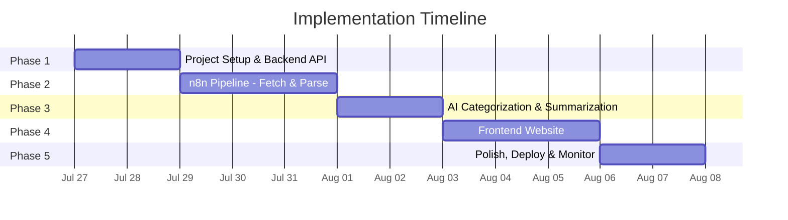
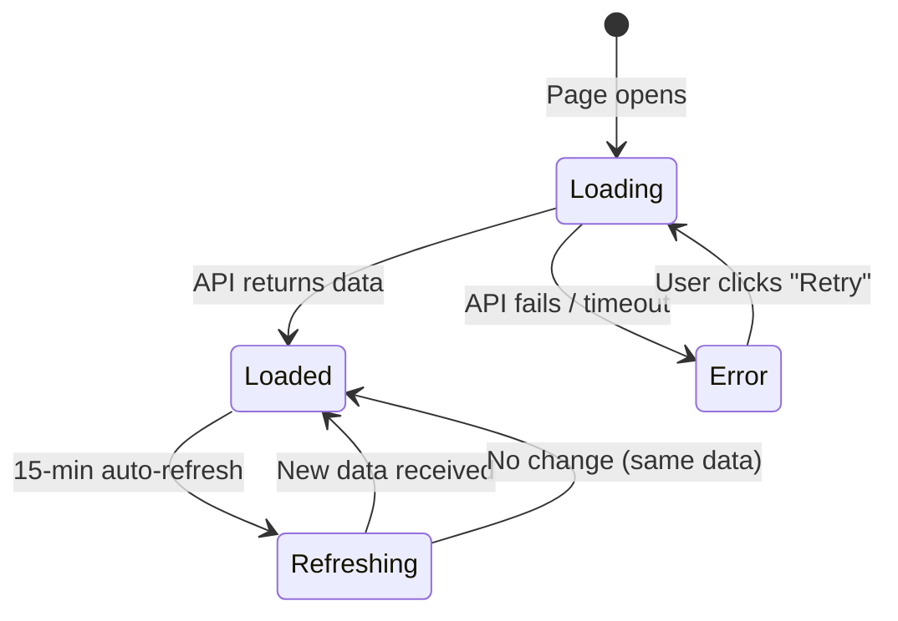
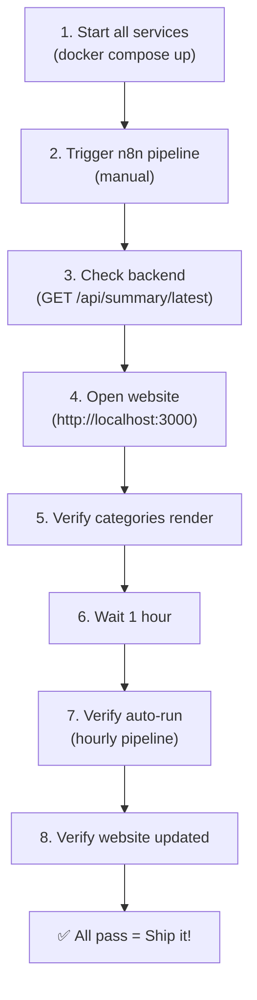
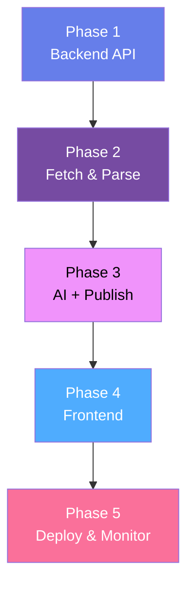

# Implementation Plan: AI News Summarizer Agent for India

> **Phase-wise roadmap** derived from [architecture.md](file:///d:/NEXTLEAP%20GEN%20AI/AI_AGENT_AUTOMATION/docs/architecture.md) and [problemStatement.md](file:///d:/NEXTLEAP%20GEN%20AI/AI_AGENT_AUTOMATION/docs/problemStatement.md)

---

## Plan Overview

The implementation is divided into **5 phases**, each building on the previous one. Every phase ends with a working, testable deliverable — so the system is usable incrementally, not just at the end.



| Phase | Name | Duration | Key Deliverable |
|-------|------|----------|-----------------|
| **1** | Project Setup & Backend API | 2 days | Working REST API that stores/serves summaries |
| **2** | n8n Pipeline — Fetch & Parse | 3 days | n8n workflow that scrapes 5 news sites and extracts articles |
| **3** | AI Categorization & Summarization | 2 days | AI nodes that categorize and summarize, publishing to the API |
| **4** | Frontend Website | 3 days | Responsive website displaying the latest briefing |
| **5** | Polish, Deploy & Monitor | 2 days | Dockerized deployment, monitoring, documentation |

**Total estimated duration: ~12 days**

---

## Phase 1 — Project Setup & Backend API

> **Goal:** Set up the project structure and build the backend API that will serve as the central data layer for all other components.

### Why First?

The backend API is the **single source of truth** — both the n8n pipeline (writes) and the frontend (reads) depend on it. Building it first gives us a stable contract to develop against.

### 1.1 Tasks

#### 1.1.1 Project Initialization

- [ ] Create the root directory structure as defined in [architecture.md § 16](file:///d:/NEXTLEAP%20GEN%20AI/AI_AGENT_AUTOMATION/docs/architecture.md):
  ```
  AI_AGENT_AUTOMATION/
  ├── docs/
  ├── backend/
  ├── frontend/
  ├── n8n/
  │   ├── workflows/
  │   └── parsers/
  ├── docker-compose.yml
  ├── .env.example
  ├── .gitignore
  └── README.md
  ```
- [ ] Initialize `backend/` with `npm init`
- [ ] Create `.gitignore` (node_modules, .env, data/summaries/*.json)
- [ ] Create `.env.example` with all required environment variables

#### 1.1.2 Backend API Server

- [ ] Install dependencies: `express`, `cors`, `express-rate-limit`, `dotenv`, `uuid`
- [ ] Create [backend/src/config.js](file:///d:/NEXTLEAP%20GEN%20AI/AI_AGENT_AUTOMATION/backend/src/config.js) — environment configuration
- [ ] Create [backend/src/server.js](file:///d:/NEXTLEAP%20GEN%20AI/AI_AGENT_AUTOMATION/backend/src/server.js) — Express app entry point

#### 1.1.3 API Routes

Implement the 4 endpoints from [architecture.md § 15](file:///d:/NEXTLEAP%20GEN%20AI/AI_AGENT_AUTOMATION/docs/architecture.md):

| File | Endpoint | Description |
|------|----------|-------------|
| `routes/summary.js` | `POST /api/summary` | Receive & store a new summary (API key auth) |
| `routes/summary.js` | `GET /api/summary/latest` | Return the most recent summary |
| `routes/summary.js` | `GET /api/summary/history` | Return paginated history (metadata only) |
| `routes/health.js` | `GET /api/health` | Health check with last-summary timestamp |

- [ ] Create `routes/summary.js` with POST, GET latest, GET history
- [ ] Create `routes/health.js` with uptime and summary freshness

#### 1.1.4 Middleware

- [ ] Create `middleware/auth.js` — API key validation for POST routes
- [ ] Create `middleware/rateLimiter.js` — 100 req / 15 min per IP
- [ ] Create `middleware/validator.js` — validate summary payload schema

#### 1.1.5 Storage Service

- [ ] Create `services/storageService.js` — file-based JSON store
  - `saveSummary(payload)` — write `latest.json` + timestamped archive
  - `getLatestSummary()` — read `latest.json`
  - `getHistory(limit, offset)` — list archived files with metadata
  - `cleanupOldArchives(maxAge)` — delete files older than 7 days
- [ ] Implement atomic writes (write to temp file, then `rename`)
- [ ] Create `data/summaries/.gitkeep`

#### 1.1.6 Logging

- [ ] Create `utils/logger.js` — simple console logger with timestamps and levels

### 1.2 Verification

| Test | How |
|------|-----|
| POST a sample summary | `curl -X POST http://localhost:3001/api/summary -H "X-API-Key: test" -H "Content-Type: application/json" -d @sample.json` |
| GET latest summary | `curl http://localhost:3001/api/summary/latest` |
| GET history | `curl http://localhost:3001/api/summary/history?limit=5` |
| Health check | `curl http://localhost:3001/api/health` |
| Auth rejection | `curl -X POST http://localhost:3001/api/summary` (expect 401) |
| Rate limiting | Fire 101 rapid requests, expect 429 on the 101st |

- [ ] Create `backend/test/sample-summary.json` with mock data matching the schema
- [ ] Manually test all 4 endpoints
- [ ] Verify `latest.json` and timestamped archive files are created correctly

### 1.3 Files Created

```
backend/
├── package.json
├── .env.example
├── src/
│   ├── server.js
│   ├── config.js
│   ├── routes/
│   │   ├── summary.js
│   │   └── health.js
│   ├── middleware/
│   │   ├── auth.js
│   │   ├── rateLimiter.js
│   │   └── validator.js
│   ├── services/
│   │   └── storageService.js
│   └── utils/
│       └── logger.js
├── data/
│   └── summaries/.gitkeep
└── test/
    └── sample-summary.json
```

---

## Phase 2 — n8n Pipeline: Fetch & Parse

> **Goal:** Build the first half of the n8n workflow — from schedule trigger through content extraction and deduplication. By the end, we have clean, deduplicated article data ready for AI processing.

### Why This Order?

Scraping and parsing are the most **brittle** parts of the system — news site layouts change, HTML structures vary, and some sites may block requests. Getting this stable first means the AI layer receives clean, reliable input.

### 2.1 Tasks

#### 2.1.1 n8n Setup

- [x] Set up n8n Cloud workspace and configure workflows
- [x] Set timezone in cloud workflow settings (Asia/Kolkata)
- [x] Create a new workflow: **"India News Pipeline"**
- [x] Add environment variables:
  - `BACKEND_API_URL` — backend server URL
  - `API_KEY` — for POSTing summaries

#### 2.1.2 Trigger & Source Configuration

- [x] Add **Schedule Trigger** node (every 1 hour)
- [x] Add **Manual Trigger** node (for development)
- [x] Add **Set Sources** (Code node) returning the 5 news source URLs as 5 separate items:
  ```
  https://www.indiatoday.in/
  https://www.ndtv.com/india
  https://timesofindia.indiatimes.com/india
  https://www.hindustantimes.com/india-news
  https://indianexpress.com/section/india/
  ```
- [x] Rely on n8n's automatic iteration (bypassing Split in Batches/Merge)

#### 2.1.3 HTTP Fetch Node

- [x] Add **HTTP Request** node for each source URL
- [x] Configure headers (User-Agent to avoid bot blocking)
- [x] Set timeout (30 seconds per request)
- [x] Add error handling (continue on fail for individual sources)

#### 2.1.4 Unified Regex HTML Parser

Build a single **Code Node** with a unified regex-based JavaScript parser.

- [x] Create a robust regex to find `<h2>` and `<h3>` tags in raw HTML
- [x] Extract `title`, `url`, `snippet`, and `source` seamlessly across all 5 sites
- [x] Strip inner HTML tags and decode HTML entities
- [x] Add fallback: generate dummy sample articles if 0 titles extracted to prevent pipeline failure

#### 2.1.5 Deduplicate

- [x] Add **Function Node** for deduplication:
  - Normalize titles (lowercase, strip punctuation)
  - Remove articles with duplicate or near-duplicate titles (substring match)

#### 2.1.6 Article Content Enrichment (Optional)

- [ ] For articles with short snippets, optionally fetch the full article page
- [ ] Extract the first 500 characters of body text
- [ ] Respect rate limits (max 2 requests/second per domain)

### 2.2 Verification

| Test | Expected |
|------|----------|
| Manual trigger → all 5 sources | HTTP 200 from each, raw HTML received |
| Parser output | 5–15 articles per source, all with title + url |
| Deduplication | ~30–40 unique articles from ~50–60 raw |
| Failed source handling | If 1 source is down, pipeline continues with 4 |

- [x] Run the workflow manually and inspect each node's output
- [x] Verify article data structure matches the expected schema
- [x] Test with one source URL intentionally broken (404) — pipeline should continue
- [x] Export workflow as `n8n/workflows/news-pipeline.json`

### 2.3 Files Created

```
n8n/
├── workflows/
│   └── news-pipeline.json       # Exported n8n workflow (partial: fetch + parse)
└── parsers/
    ├── indiatoday.js
    ├── ndtv.js
    ├── timesofindia.js
    ├── hindustantimes.js
    └── indianexpress.js
```

---

## Phase 3 — AI Categorization & Summarization

> **Goal:** Add AI nodes to the n8n pipeline that categorize extracted articles and generate concise summaries, then publish the result to the backend API.

### Why After Parsing?

The AI layer depends on clean, deduplicated article data from Phase 2. Also, prompt engineering is iterative — having real article data to test against makes prompt tuning much more effective.

### 3.1 Tasks

#### 3.1.1 AI Credential Setup

- [x] Choose AI provider: **Google Gemini** (Model: **Gemini 3.5 Flash Lite**)
- [x] Configure API credentials securely in n8n Cloud credential store
- [x] Set up n8n variable for `Gemini_API_Key`
- [x] **Rate Limits to enforce / monitor:**
  - Requests per minute: 15
  - Tokens per minute: 250K
  - Requests per day: 500

#### 3.1.2 Stage 1 — AI Categorization Node

- [x] Add an **HTTP Request** node calling Gemini API directly after deduplication
- [x] Configure the categorization prompt from [architecture.md § 9.2](file:///d:/NEXTLEAP%20GEN%20AI/AI_AGENT_AUTOMATION/docs/architecture.md):

  ```
  You are a news categorization assistant. Given a list of Indian news articles,
  classify each article into exactly ONE of these categories:
  Politics, Sports, Business, Technology, Entertainment, Health, Education, Crime,
  Weather, World.

  Return a JSON array where each item has the original article fields plus a
  "category" field.
  ```

- [x] Set response format to JSON
- [x] Add a **Code Node** to validate/parse AI output (handle malformed JSON)
- [x] Test with real articles — verify categories make sense

#### 3.1.3 Stage 2 — AI Summarization Node

- [x] Add a second **HTTP Request** node calling Gemini API directly
- [x] Group articles by category before sending to the summarizer
- [x] Configure the summarization prompt from [architecture.md § 9.2](file:///d:/NEXTLEAP%20GEN%20AI/AI_AGENT_AUTOMATION/docs/architecture.md):

  ```
  Produce a concise summary for each category. Output must be valid JSON:
  {
    "categories": [
      {
        "name": "Category Name",
        "summaryPoints": ["Point 1", "Point 2"],
        "sources": [{ "title": "...", "url": "...", "source": "..." }]
      }
    ]
  }
  ```

- [x] Set response format to JSON
- [x] Add validation node for AI output structure

#### 3.1.4 Output Formatting

- [x] Add a **Code Node** to build the final summary payload:
  ```json
  {
    "timestamp": "2026-07-27T11:00:00Z",
    "generatedAt": "...",
    "sourcesUsed": ["indiatoday.in", "ndtv.com", ...],
    "totalArticlesProcessed": 47,
    "totalArticlesAfterDedup": 32,
    "categories": [...]
  }
  ```
- [x] Add metadata: model used, pipeline duration, error count
- [x] Generate optional Markdown output for debugging

#### 3.1.5 Publish to Backend API

- [x] Add **HTTP Request** node: `POST /api/summary`
- [x] Set headers: `Content-Type: application/json`, `X-API-Key: {{$env.API_KEY}}`
- [x] Set body to the formatted JSON payload
- [x] Handle response: log success (201) or failure (4xx/5xx)

#### 3.1.6 Error Handling

- [x] Add **Error Trigger** node for the workflow
- [x] Implement retry logic: 3 attempts with exponential backoff for AI API calls (ensure we stay within 15 RPM and 500 RPD limits)
- [x] If AI returns invalid JSON, retry with a stricter prompt
- [x] Log all errors with source and stage information

### 3.2 Prompt Tuning Checklist

| Criteria | Check |
|----------|-------|
| Categories match the defined list (10 categories) | [ ] |
| No articles are left uncategorized | [ ] |
| Summary points are 1–2 sentences each | [ ] |
| 2–5 summary points per category | [ ] |
| Source links are preserved and correct | [ ] |
| No hallucinated facts | [ ] |
| Neutral, factual language | [ ] |
| Empty categories are omitted | [ ] |
| JSON output parses correctly | [ ] |

### 3.3 Verification

| Test | Expected |
|------|----------|
| Full pipeline run (manual trigger) | Summary JSON POSTed to backend, stored as `latest.json` |
| `GET /api/summary/latest` | Returns the freshly generated summary |
| AI output validation | All categories valid, no undefined fields |
| Token usage | < 20,000 input + output tokens per run |
| Pipeline duration | < 2 minutes end-to-end |

- [x] Run full pipeline 3 times and compare output quality
- [x] Verify `latest.json` is updated correctly each time
- [x] Check token usage in AI provider dashboard
- [x] Export updated workflow as `n8n/workflows/news-pipeline.json`

### 3.4 Files Modified

```
n8n/
└── workflows/
    └── news-pipeline.json       # Updated: now includes AI + publish nodes
```

---

## Phase 4 — Frontend Website

> **Goal:** Build a responsive, visually polished website that displays the latest India news briefing by reading from the backend API.

### Why After Pipeline?

The frontend needs real data to develop and test against. With the pipeline + API running, we can build the frontend against live summaries.

### 4.1 Tasks

#### 4.1.1 Next.js App Initialization

- [ ] Initialize a new Next.js app in the `frontend` directory using `npx create-next-app@latest .`
- [ ] Implement `app/layout.tsx` for global metadata, fonts, and responsive layout structure.
- [ ] Create standard header and footer components.
- [ ] Create a main page (`app/page.tsx`) to display the news briefing.

#### 4.1.2 UI Components & Styling

- [ ] Configure Tailwind CSS (default in Next.js) or standard CSS modules for styling.

| Feature | Implementation |
|---------|---------------|
| **Color palette** | HSL-based dark theme with vibrant accents |
| **Typography** | Google Fonts `Inter` (headings) + system fallbacks |
| **Layout** | CSS Grid: 2 columns desktop, 1 column mobile |
| **Cards** | Glassmorphism: `backdrop-filter: blur`, subtle borders |
| **Animations** | Fade-in on load, hover scale on cards, shimmer skeleton |
| **Dark mode** | Default dark, light mode toggle available |
| **Responsiveness** | Mobile-first, breakpoints at 768px and 1024px |

#### 4.1.3 JavaScript Logic

- [ ] Implement data fetching and rendering logic in React components:

| Component / Function | Behavior |
|----------------------|----------|
| `fetchLatestSummary()` | `GET /api/summary/latest`, handle loading/error states (e.g., inside `useEffect` or Server Component) |
| `renderCategories(data)` | Dynamically build category cards with summary points + sources |
| `renderTimestamp(ts)` | Show "Updated X minutes ago" with `Intl.RelativeTimeFormat` |
| `showSkeleton()` | Display shimmer loading placeholders |
| `showError(msg)` | "Unable to load" message with retry button |
| `autoRefresh()` | `setInterval` every 15 minutes |
| `toggleDarkMode()` | Switch between dark/light theme, persist in `localStorage` |

- [ ] Map category names to emoji icons:
  ```javascript
  const ICONS = {
    'Politics': '🏛️', 'Sports': '⚽', 'Business': '💼',
    'Technology': '💻', 'Entertainment': '🎬', 'Health': '🏥',
    'Education': '📚', 'Crime': '⚖️', 'Weather': '🌦️',
    'World': '🌍', 'Environment': '🌿'
  };
  ```

#### 4.1.4 Static Assets

- [ ] Create or generate `frontend/public/favicon.ico`
- [ ] Create or generate `frontend/public/og-image.png` (Open Graph preview)

#### 4.1.5 Next.js Configuration

- [ ] Configure `next.config.js` or `next.config.mjs`:
  - Setup API rewrites if necessary (e.g., `/api/:path*` to the backend service).
  - Configure image domains if external images are used.

### 4.2 UI States to Handle



| State | Visual |
|-------|--------|
| **Loading** | Skeleton shimmer cards (no content, animated gradient) |
| **Loaded** | Full category cards with summaries, sources, timestamp |
| **Error** | Centered error icon + message + "Retry" button |
| **Refreshing** | Subtle spinner in header, content remains visible |
| **Empty category** | Card not shown (omit categories with no articles) |

### 4.3 Verification

| Test | Expected |
|------|----------|
| Run `npm run dev` and open `localhost:3000` | Categories render with real data |
| Resize to mobile width (375px) | Single-column layout, readable text |
| Kill backend, reload page | Error state with retry button |
| Wait 15 minutes (or reduce interval for test) | Auto-refresh pulls latest data |
| Toggle dark/light mode | Theme switches, persists on reload |
| View page source | Proper meta tags, semantic HTML, single `<h1>` |

- [ ] Test on Chrome, Firefox, Edge
- [ ] Test on mobile viewport (Chrome DevTools)
- [ ] Lighthouse audit: aim for > 90 on all scores
- [ ] Verify all interactive elements have unique IDs

### 4.4 Files Created

```
frontend/
├── app/
│   ├── page.tsx
│   ├── layout.tsx
│   └── globals.css
├── components/
│   └── CategoryCard.tsx
├── public/
│   ├── favicon.ico
│   └── og-image.png
└── next.config.mjs
```

---

## Phase 5 — Polish, Deploy & Monitor

> **Goal:** Containerize all services, deploy the full stack, add monitoring, and finalize documentation.

### 5.1 Tasks

#### 5.1.1 Dockerize Services

- [ ] Create [backend/Dockerfile](file:///d:/NEXTLEAP%20GEN%20AI/AI_AGENT_AUTOMATION/backend/Dockerfile):
  ```dockerfile
  FROM node:20-alpine
  WORKDIR /app
  COPY package*.json ./
  RUN npm ci --production
  COPY src/ ./src/
  RUN mkdir -p data/summaries
  EXPOSE 3001
  CMD ["node", "src/server.js"]
  ```

- [ ] Create [frontend/Dockerfile](file:///d:/NEXTLEAP%20GEN%20AI/AI_AGENT_AUTOMATION/frontend/Dockerfile):
  ```dockerfile
  FROM node:20-alpine
  WORKDIR /app
  COPY package*.json ./
  RUN npm ci
  COPY . .
  RUN npm run build
  EXPOSE 3000
  CMD ["npm", "start"]
  ```

- [ ] Create [docker-compose.yml](file:///d:/NEXTLEAP%20GEN%20AI/AI_AGENT_AUTOMATION/docker-compose.yml) as defined in [architecture.md § 12.2](file:///d:/NEXTLEAP%20GEN%20AI/AI_AGENT_AUTOMATION/docs/architecture.md)

#### 5.1.2 Docker Compose Full Stack

- [ ] `docker compose up --build` — verify backend and frontend services start
- [ ] Test end-to-end: trigger n8n Cloud workflow → verify summary appears on website

#### 5.1.3 Health & Monitoring

- [ ] Verify `GET /api/health` returns correct status
- [ ] Add a log rotation strategy for backend logs
- [ ] Set up n8n execution log retention (keep last 7 days)
- [ ] Document key metrics to watch (from [architecture.md § 13.3](file:///d:/NEXTLEAP%20GEN%20AI/AI_AGENT_AUTOMATION/docs/architecture.md)):

  | Metric | Target |
  |--------|--------|
  | Pipeline success rate | > 90% |
  | Pipeline duration | < 120s |
  | Articles per run | 30–60 |
  | API response time | < 100ms |

#### 5.1.4 Security Hardening

- [ ] Ensure all secrets are in `.env`, never in code
- [ ] CORS restricted to frontend origin only
- [ ] Rate limiter active on all public endpoints
- [ ] API key required for all write operations
- [ ] Content sanitization on article snippets (prevent XSS)

#### 5.1.5 Error Resilience — Final Checks

- [ ] Test: kill one news source mid-pipeline → pipeline completes with remaining 4
- [ ] Test: AI API rate limit hit → retry works correctly
- [ ] Test: backend disk full → atomic write fails safely, `latest.json` not corrupted
- [ ] Test: overlapping pipeline runs → no concurrent write corruption

#### 5.1.6 Documentation

- [ ] Update [README.md](file:///d:/NEXTLEAP%20GEN%20AI/AI_AGENT_AUTOMATION/README.md):
  - Project overview
  - Prerequisites (Node.js, Docker, n8n, AI API key)
  - Quick start guide
  - Environment variables reference
  - Architecture overview (link to docs/)
- [ ] Verify all docs are up-to-date with final implementation

### 5.2 Final Verification — Full Integration Test



| # | Test | Pass criteria |
|---|------|---------------|
| 1 | `docker compose up` | Backend and Frontend services healthy |
| 2 | Manual pipeline trigger | Completes in < 2 minutes |
| 3 | GET latest summary | Returns valid JSON with categories |
| 4 | Open website | Page loads, shows categories |
| 5 | Category cards | At least 5 categories with summaries |
| 6 | Hourly auto-run | Pipeline runs on schedule |
| 7 | Website refresh | New data appears after pipeline run |
| 8 | Mobile responsive | Website works on 375px viewport |

### 5.3 Files Created / Modified

```
AI_AGENT_AUTOMATION/
├── backend/
│   └── Dockerfile
├── frontend/
│   └── Dockerfile
├── docker-compose.yml
├── .env.example               # Updated with all variables
├── .gitignore                 # Updated
└── README.md                  # Final documentation
```

---

## Dependency Map

The diagram below shows the sequential phase dependencies:



> [!TIP]
> Each phase builds directly on the previous one, ensuring a stable foundation at every step.

---

## Risk Register

| Risk | Likelihood | Impact | Mitigation |
|------|-----------|--------|------------|
| News site blocks scraping | Medium | High | Use rotating User-Agents, fall back to RSS feeds, build multiple parser strategies |
| News site HTML structure changes | High | Medium | Keep parsers modular and site-specific; alert on 0-article extraction |
| AI model returns invalid JSON | Medium | Medium | Validate and retry with stricter prompt; add JSON repair logic |
| AI API rate limits or outages | Low | High | Retry with exponential backoff; have a fallback model configured |
| High AI API costs | Low | Medium | Monitor token usage; use cheaper model (gpt-4o-mini) for categorization |
| Backend disk fills up | Low | High | Enforce 7-day retention; monitor disk usage |
| Concurrent pipeline runs corrupt data | Low | High | Use atomic writes; add file-level locking |

---

## Quick Reference: Environment Variables

| Variable | Phase | Service | Example |
|----------|-------|---------|---------|
| `PORT` | 1 | Backend | `3001` |
| `API_KEY` | 1 | Backend / n8n | `sk-my-secret-key-123` |
| `DATA_DIR` | 1 | Backend | `./data/summaries` |
| `CORS_ORIGIN` | 1 | Backend | `http://localhost:3000` |
| `BACKEND_API_URL` | 2 | n8n | `http://backend:3001` |
| `Gemini_API_Key` | 3 | n8n Cloud | `AIzaSy...` |
