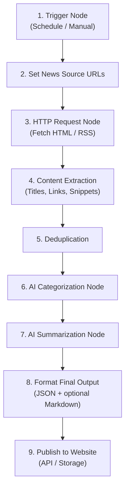

# Problem Statement: AI News Summarizer Agent for India

---

## 1. Overview

The goal of this project is to build an **AI Agent in n8n**, with development support from tools such as Cursor or Antigravity, that collects and summarizes the latest news happening in India, and publishes that summary to a **frontend website** so people can read it in a browser.

The agent should fetch news from **4–5 reliable Indian news website URLs**, process the latest articles, categorize them by topic, generate concise summaries for each category, and update the website with the latest briefing.

> **Example source:** <https://www.indiatoday.in/>

The final output should provide a structured news briefing on a public (or shared) website that helps users quickly understand the most important updates across India without manually browsing multiple news websites.

---

## 2. Problem

People often need to stay updated with current affairs in India, but news is spread across multiple websites and categories. Reading every article takes time, and important updates may be missed.

The problem is to **automate this process** by creating an AI-powered news summarization agent that can:

- Visit selected news website URLs.
- Extract the latest news articles.
- Identify the topic or category of each article.
- Summarize the news in simple, clear language.
- Group the summaries under meaningful news categories.
- Continuously refresh a website so anyone can open it and see the latest summary.

---

## 3. Objective

Build an AI Agent using **n8n** that automatically gathers, categorizes, and summarizes the latest Indian news from selected news websites, and push the result to a frontend website that displays the latest briefing.

The agent should produce a clean, readable summary grouped by categories such as:

| # | Category                |
|---|-------------------------|
| 1 | Politics                |
| 2 | Sports                  |
| 3 | Business                |
| 4 | Technology              |
| 5 | Entertainment           |
| 6 | World                   |
| 7 | Health                  |
| 8 | Education               |
| 9 | Crime                   |
| 10| Weather / Environment   |

The website should show the most recently published summary, including **when it was last updated**.

---

## 4. Example News Sources

The workflow can use **4–5 news website URLs** as input sources. Example sources may include:

| Source              | URL                                              |
|---------------------|--------------------------------------------------|
| India Today         | <https://www.indiatoday.in/>                     |
| NDTV India          | <https://www.ndtv.com/india>                     |
| Times of India      | <https://timesofindia.indiatimes.com/india>      |
| Hindustan Times     | <https://www.hindustantimes.com/india-news>      |
| Indian Express      | <https://indianexpress.com/section/india/>       |

> [!NOTE]
> These URLs can be updated or replaced depending on the requirement.

---

## 5. Expected Features

The AI Agent should include the following features:

### 5.1 News Collection

The agent should fetch the latest articles from each configured news website URL. It should collect useful information such as:

- **Article title**
- **Article URL**
- **Published date or time** (if available)
- **Article content or snippet**
- **Source website name**

### 5.2 News Categorization

The agent should classify each article into a relevant category.

| Category              | Covers                                                         |
|-----------------------|----------------------------------------------------------------|
| **Politics**          | Elections, government decisions, policies, political parties, parliament updates |
| **Sports**            | Cricket, football, Olympics, tournaments, player updates       |
| **Business**          | Economy, markets, startups, company updates, finance           |
| **Technology**        | AI, gadgets, software, cybersecurity, digital India            |
| **Entertainment**     | Bollywood, celebrities, movies, TV, streaming                  |
| **Health**            | Public health, disease updates, hospitals, medical research    |
| **Education**         | Exams, colleges, admissions, government education policies     |
| **Crime**             | Law enforcement, investigations, court-related incidents       |
| **Weather / Environment** | Climate, monsoon, pollution, natural disasters             |

### 5.3 News Summarization

For each category, the agent should generate a short and clear summary. The summary should:

- ✅ Highlight the most important news points.
- ✅ Avoid unnecessary details.
- ✅ Be written in simple language.
- ✅ Include source links for reference.
- ❌ Avoid copying large portions of article text directly.

### 5.4 Scheduled Refresh

- The agent should run on a **recurring schedule (every hour)** so the website stays close to current.
- Each successful run should **replace (or atomically update)** the "latest summary" shown on the website.

### 5.5 Frontend Website Display

A frontend website (to be built as part of this project) should display the latest India news summary for visitors. The site should:

- Show **category-grouped summaries** with source links.
- Show a **last updated timestamp**.
- Be readable on **desktop and mobile**.
- Load the latest briefing from the data published by the n8n agent (via API or stored payload).

### 5.6 Final Output

The final structured output (consumed by the website) should be grouped by category.

**Example shape** (conceptual Markdown view):

```markdown
# India News Summary

Last updated: 2026-07-26 11:00 IST

## Politics

- Summary of the most important political news.
- Source: Article title - URL

## Sports

- Summary of major sports updates.
- Source: Article title - URL

## Business

- Summary of key business and economy news.
- Source: Article title - URL
```

> [!IMPORTANT]
> The machine-readable form should be **JSON** suitable for a website API (see architecture).

---

## 6. Suggested n8n Workflow

The n8n workflow may follow these steps:



| Step | Node                     | Description                                                                 |
|------|--------------------------|-----------------------------------------------------------------------------|
| 1    | **Trigger Node**         | Run every hour on a schedule, plus a manual trigger for development.        |
| 2    | **Set News Source URLs**  | Store 4–5 news website URLs in a configuration node.                        |
| 3    | **HTTP Request Node**    | Fetch HTML or RSS content from each news source.                            |
| 4    | **Content Extraction**   | Extract article titles, links, snippets, and article body content.          |
| 5    | **Deduplication**        | Remove duplicate articles or repeated news topics.                          |
| 6    | **AI Categorization**    | Send article metadata/content to an AI model to classify into a category.   |
| 7    | **AI Summarization**     | Ask the AI model to summarize the articles category-wise.                   |
| 8    | **Format Final Output**  | Convert categorized summaries into structured JSON (+ optional Markdown).   |
| 9    | **Publish to Website**   | Send the latest summary payload to the frontend backend/API.                |

---

## 7. Role of Cursor or Antigravity

Cursor or Antigravity can be used to help build and improve the workflow and website by:

- Writing custom **JavaScript functions** for n8n Function nodes.
- Creating **parsers** for news pages.
- Debugging **API responses**.
- Designing **prompts** for categorization and summarization.
- Structuring the final **JSON / Markdown** output.
- Building the **frontend website** that renders the summary.
- Improving **error handling** and logging.

---

## 8. AI Prompt Requirements

The AI prompt should instruct the model to:

- Summarize **only** the provided news content.
- Group news by category.
- Keep summaries short and factual.
- Mention sources wherever possible.
- Avoid hallucinating facts not present in the article.
- Ignore advertisements, navigation text, and unrelated page content.
- Avoid political bias and sensational language.

### Example Prompt

```text
You are an AI news summarization assistant.

Given the following list of news articles from Indian news websites, categorize
each article and produce a concise summary for each category.

Categories may include Politics, Sports, Business, Technology, Entertainment,
Health, Education, Crime, Weather, and World.

Rules:
1. Use only the article information provided.
2. Do not invent facts.
3. Keep each category summary concise.
4. Include source article links.
5. Avoid duplicate news.
6. Use neutral and factual language.

Input:
{{articles}}

Output format:
# India News Summary

## Category Name
- Summary bullet point
- Source: Article title - Article URL
```

---

## 9. Success Criteria

The project will be considered successful if the AI Agent can:

- [x] Fetch news from multiple Indian news websites.
- [x] Extract relevant news articles correctly.
- [x] Categorize articles into meaningful news sections.
- [x] Generate clear and concise summaries.
- [x] Include source links for traceability.
- [x] Run automatically every hour.
- [x] Publish the latest summary so a frontend website can display it.
- [x] Allow people to open the website and read an up-to-date, easy-to-scan briefing.

---

## 10. Assumptions

> [!NOTE]
> The following assumptions underpin the design:

- The selected news websites are **publicly accessible**.
- The workflow is allowed to fetch news content from the selected URLs.
- Some websites may require **RSS feeds, APIs, or special parsing logic**.
- The summarization model has access only to the extracted article content, **not the full internet**.
- A frontend website (and a small API or storage layer) will be built to receive and display the summary.
- **Email / Gmail delivery is out of scope** for this project.

---

## 11. Constraints

> [!WARNING]
> These constraints must be respected throughout implementation:

- The workflow should **not copy full articles**.
- The AI model should **avoid generating unsupported claims**.
- The agent should handle **broken links or unavailable pages** gracefully.
- Website layouts may change, so parsing logic should be **maintainable**.
- The agent should **avoid duplicate summaries** for the same news story.
- Publishing to the website should be **atomic** where possible so visitors do not see a half-updated briefing.
- Overlapping hourly runs should **not corrupt** the latest summary (no concurrent writes without locking / last-write safeguards).

---

## 12. Deliverable

> [!IMPORTANT]
> The final deliverable consists of two components:

1. **n8n AI Agent Workflow** — Generates a categorized summary of the latest news happening in India from selected news website URLs, runs every hour, and publishes the result to the website backend/API.

2. **Frontend Website** — Displays the latest category-wise news summary with source links and a last-updated timestamp.

Together, these should support **continuous public (or shared) consumption** of an India news briefing without requiring email.
